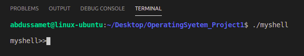
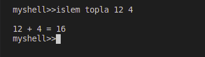
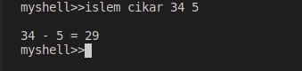
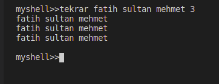
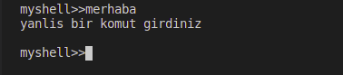
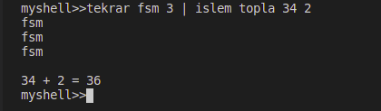
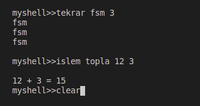
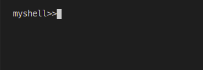
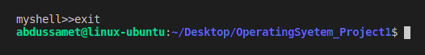

# MyShell
Basic shell application in operating system lesson. In this shell, addition and subtraction operations can be done from 
arithmetic operations. In addition, functions such as pressing a text to the console more than once and processing more 
than one command at a time are also included.

## Run App


## Addition Arithmetic Operation


```
islem [type of arithmetic operation] [num1] [num2]
islem -> arithmetic operation
topla -> addition
cikar -> subtraction
then number 1 and number 2 (shell only supports operations for 2 numbers)
```

## Subtraction Arithmetic Operation


## Repeat Operation


```
tekrar [string] [number of iteration]
tekrar -> repeat
```

## Wrong Command


If you enter a wrong command, then print error message.

## Multiple Command


Commands '|' character is separated and run sequentially.

## Clear Console


Then enter



## Exit
